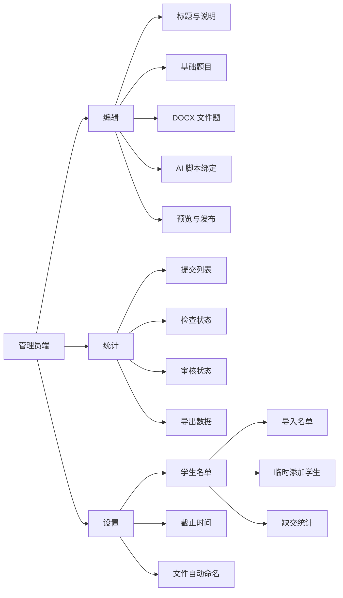
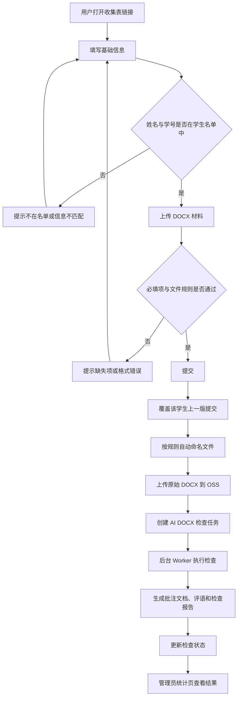
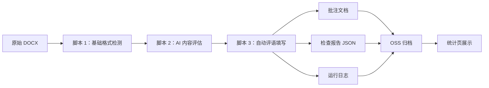
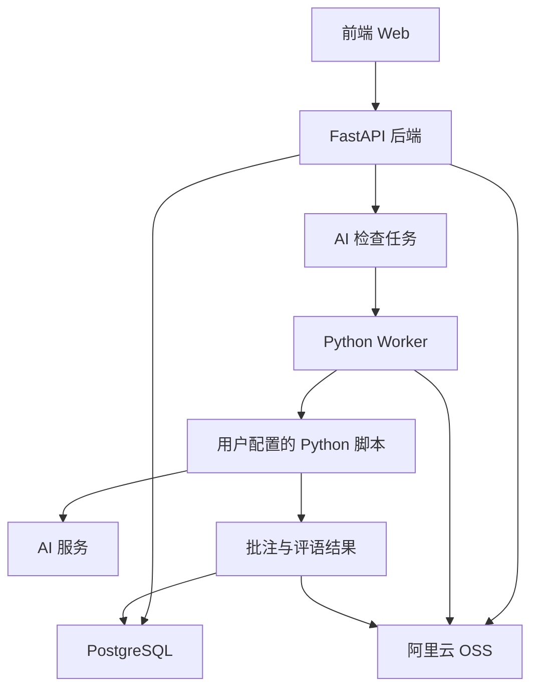

# 收集表设计图

## 页面结构



## 用户提交流程



## AI DOCX 处理链路



## 模块关系



## 最小页面草图

```text
┌────────────────────────────────────────────────────────────┐
│ 收集表标题                                                  │
│ 说明文字 / 截止时间 / 仅名单内学生可填写                    │
├────────────────────────────────────────────────────────────┤
│ 题目 1：姓名 *                                             │
│ [________________________________]                         │
│                                                            │
│ 题目 2：学号 *                                             │
│ [________________________________]                         │
│                                                            │
│ 题目 3：上传毕业论文正文 DOCX *                            │
│ [ 选择文件 ] 仅支持 .docx                                  │
│                                                            │
│ 题目 4：补充说明                                           │
│ [________________________________]                         │
├────────────────────────────────────────────────────────────┤
│ [提交]                                                     │
└────────────────────────────────────────────────────────────┘
```

## 管理员设置页草图

```text
┌────────────────────────────────────────────────────────────┐
│ 设置                                                       │
├────────────────────────────────────────────────────────────┤
│ 截止时间                                                   │
│ [ 2026-07-20 23:59 ]                                      │
│                                                            │
│ 固定规则                                                   │
│ 仅学生名单内可填写；重复提交自动覆盖上一版                  │
│                                                            │
│ 文件自动命名                                               │
│ [ 学号-姓名-材料名称.docx                         ]         │
│ 可用变量：学号、姓名、班级、材料名称、提交时间              │
│                                                            │
│ 学生名单                                                   │
│ [ 导入 Excel/CSV ]  [ 临时添加学生 ]  [ 下载模板 ]           │
│                                                            │
│ 临时添加学生                                               │
│ 姓名 [__________] 学号 [__________] 班级 [__________] [添加] │
│                                                            │
│ ┌──────────┬──────────┬──────────┬──────────┬──────────┐ │
│ │ 姓名     │ 学号     │ 班级     │ 来源     │ 状态     │ │
│ ├──────────┼──────────┼──────────┼──────────┼──────────┤ │
│ │ 张三     │ 20240001 │ 1 班     │ 导入     │ 未提交   │ │
│ │ 李四     │ 20240002 │ 1 班     │ 导入     │ 已提交   │ │
│ │ 赵六     │ 20249999 │ 临时     │ 临时添加 │ 未提交   │ │
│ └──────────┴──────────┴──────────┴──────────┴──────────┘ │
└────────────────────────────────────────────────────────────┘
```

## 管理员统计页草图

```text
┌────────────────────────────────────────────────────────────┐
│ 统计：名单 51 人 | 临时 1 | 已提交 42 | 覆盖 6 | 未提交 9       │
├──────────┬──────────┬──────────┬──────────┬───────────────┤
│ 姓名     │ 学号     │ 来源     │ 提交状态 │ 操作          │
├──────────┼──────────┼──────────┼──────────┼───────────────┤
│ 张三     │ 20240001 │ 导入     │ 已提交   │ 查看 / 下载   │
│ 李四     │ 20240002 │ 导入     │ 已覆盖   │ 查看 / 下载   │
│ 赵六     │ 20249999 │ 临时添加 │ 未提交   │ 提醒 / 编辑   │
└──────────┴──────────┴──────────┴──────────┴───────────────┘
```
