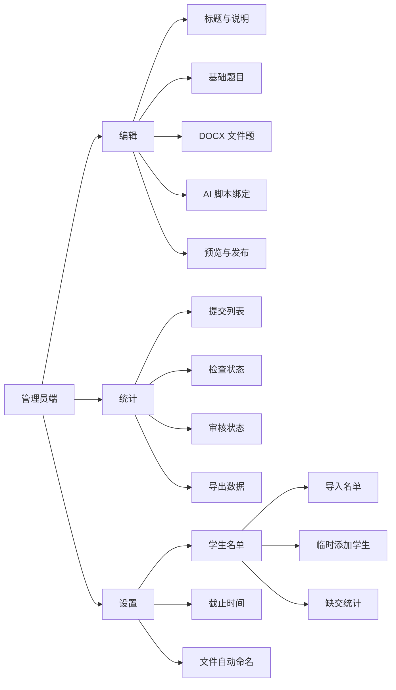
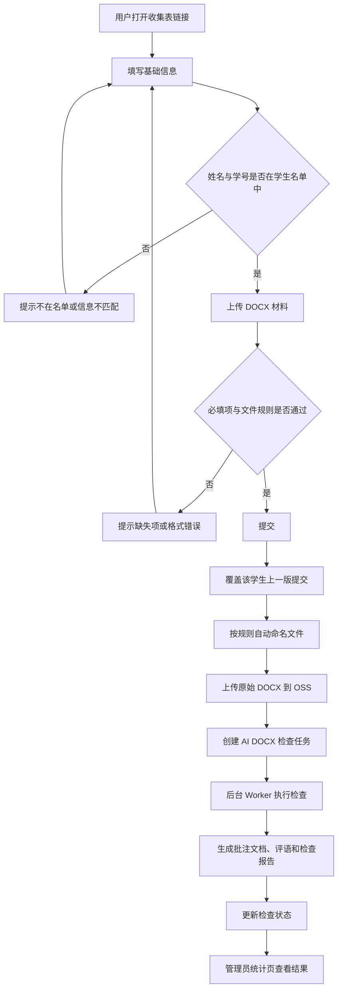
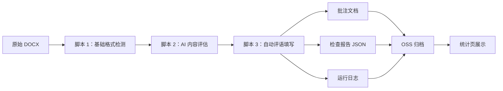
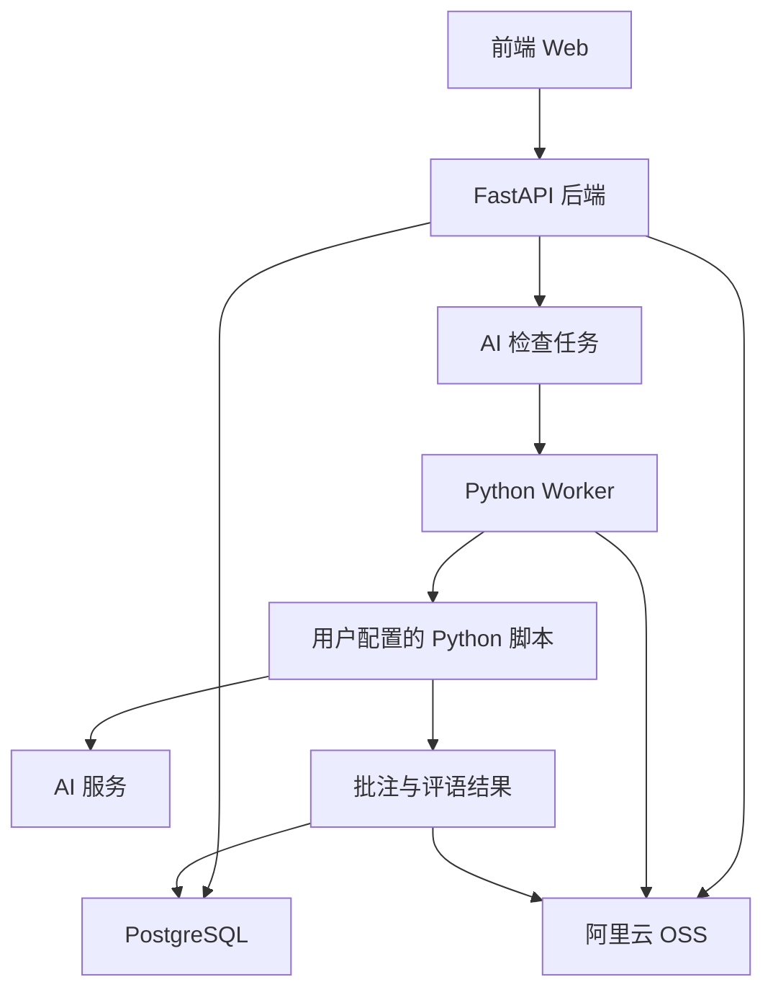

# 收集表设计图

## 页面结构



## 用户提交流程



## AI DOCX 处理链路



## 模块关系



## 管理员编辑页草图

```text
┌──────────────────────────────────────────────────────────────────────────────┐
│  首页  +   密码学作业提交                         最近保存 12:28       菜单 │
├──────────────────────────────────────────────────────────────────────────────┤
│                              编辑     统计     设置                         │
├───────────────┬──────────────────────────────────────────────────────────────┤
│ 添加问题  大纲 │  密码学作业提交                                             │
│               │  添加描述：文字、图片或链接                                  │
│ 输入问题自动匹配│  [+ 定时和重复]  [参与名单：2023软件5-6班(94)]  [+ 结束页]    │
│               │                                                              │
│ 基础题型       │  ┌────────────────────────────────────────────────────────┐ │
│ [问答题] [单选]│  │ 加入名单                                           预览 > │ │
│ [多选] [时间] │  └────────────────────────────────────────────────────────┘ │
│ [图片] [文件] │                                                              │
│ [下拉] [签名] │  ┌────────────────────────────────────────────────────────┐ │
│               │  │ *01 姓名                                                │ │
│ 高级题型       │  │ [____________________________]                          │ │
│ [量表] [评分] │  └────────────────────────────────────────────────────────┘ │
│ [表格] [矩阵] │                                                              │
│ [排序] [扫码] │  ┌────────────────────────────────────────────────────────┐ │
│               │  │ *02 学号                                                │ │
│ 常用题库       │  │ [____________________________]                          │ │
│ [姓名] [学号] │  └────────────────────────────────────────────────────────┘ │
│ [手机号]      │                                                              │
│               │  ┌────────────────────────────────────────────────────────┐ │
│               │  │ *03 上传 DOCX 材料                                      │ │
│               │  │ 文件要求：.docx；自动命名：学号-姓名-材料名称.docx       │ │
│               │  │ + 待填写人添加文件                                      │ │
│               │  └────────────────────────────────────────────────────────┘ │
│               │                                                              │
│               │  让 AI 文档助手帮你添加问题...                               │
│               │  ─────────────────────────────────────────────────────────   │
│               │                 [ 添加问题 ]                                 │
├───────────────┴──────────────────────────────────────────────────────────────┤
│                         [ 预览 ]                         [ 发布 ]             │
└──────────────────────────────────────────────────────────────────────────────┘
```

## 学生填写页草图

```text
┌────────────────────────────────────────────────────────────┐
│ 密码学作业提交                                              │
│ 仅名单内学生可提交；重复提交将覆盖上一版                    │
├────────────────────────────────────────────────────────────┤
│ *01 姓名                                                   │
│ [________________________________]                         │
│                                                            │
│ *02 学号                                                   │
│ [________________________________]                         │
│                                                            │
│ *03 上传 DOCX 材料                                         │
│ 文件要求：.docx                                            │
│ [ + 添加文件 ]                                             │
│                                                            │
│ 提示：提交后文件将按管理员规则自动命名                      │
├────────────────────────────────────────────────────────────┤
│ [提交]                                                     │
└────────────────────────────────────────────────────────────┘
```

## 管理员设置页草图

```text
┌──────────────────────────────────────────────────────────────────────────────┐
│  首页  +   密码学作业提交                         最近保存 12:28       菜单 │
├──────────────────────────────────────────────────────────────────────────────┤
│                              编辑     统计     设置                         │
├──────────────────────────────────────────────────────────────────────────────┤
│ 设置                                                                         │
│                                                                              │
│ ┌────────────────────────────────────────────────────────────────────────┐   │
│ │ 截止时间                                                               │   │
│ │ [ 2026-07-20 23:59 ]                                                   │   │
│ └────────────────────────────────────────────────────────────────────────┘   │
│                                                                              │
│ ┌────────────────────────────────────────────────────────────────────────┐   │
│ │ 固定提交规则                                                           │   │
│ │ 仅学生名单内可填写；重复提交自动覆盖上一版                             │   │
│ └────────────────────────────────────────────────────────────────────────┘   │
│                                                                              │
│ ┌────────────────────────────────────────────────────────────────────────┐   │
│ │ 文件自动命名                                                           │   │
│ │ [ 学号-姓名-材料名称.docx                                      ]        │   │
│ │ 可用变量：学号、姓名、班级、材料名称、提交时间                         │   │
│ └────────────────────────────────────────────────────────────────────────┘   │
│                                                                              │
│ ┌────────────────────────────────────────────────────────────────────────┐   │
│ │ 学生名单                                                               │   │
│ │ [ 导入 Excel/CSV ]  [ 临时添加学生 ]  [ 下载模板 ]                      │   │
│ │                                                                        │   │
│ │ 姓名 [__________] 学号 [__________] 班级 [__________] [添加]            │   │
│ │                                                                        │   │
│ │ 姓名        学号        班级      来源       状态                       │   │
│ │ 张三        20240001    1班       导入       未提交                     │   │
│ │ 李四        20240002    1班       导入       已提交                     │   │
│ │ 赵六        20249999    临时      临时添加   未提交                     │   │
│ └────────────────────────────────────────────────────────────────────────┘   │
└──────────────────────────────────────────────────────────────────────────────┘
```

## 管理员统计页草图

```text
┌──────────────────────────────────────────────────────────────────────────────┐
│  首页  +   密码学作业提交                         最近保存 12:28       菜单 │
├──────────────────────────────────────────────────────────────────────────────┤
│                              编辑     统计     设置                         │
├──────────────────────────────────────────────────────────────────────────────┤
│ 统计：名单 51 人 | 临时 1 | 已提交 42 | 覆盖 6 | 未提交 9 | 检查失败 2       │
│                                                                              │
│ [全部] [未提交] [已提交] [已覆盖] [检查失败]             [导出] [批量提醒]   │
│                                                                              │
│ ┌──────────┬──────────┬──────────┬──────────┬──────────┬───────────────┐   │
│ │ 姓名     │ 学号     │ 来源     │ 提交状态 │ 检查状态 │ 操作          │   │
│ ├──────────┼──────────┼──────────┼──────────┼──────────┼───────────────┤   │
│ │ 张三     │ 20240001 │ 导入     │ 已提交   │ 检查成功 │ 查看 / 下载   │   │
│ │ 李四     │ 20240002 │ 导入     │ 已覆盖   │ 检查中   │ 查看 / 下载   │   │
│ │ 赵六     │ 20249999 │ 临时添加 │ 未提交   │ -        │ 提醒 / 编辑   │   │
│ └──────────┴──────────┴──────────┴──────────┴──────────┴───────────────┘   │
└──────────────────────────────────────────────────────────────────────────────┘
```
